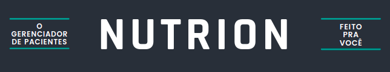
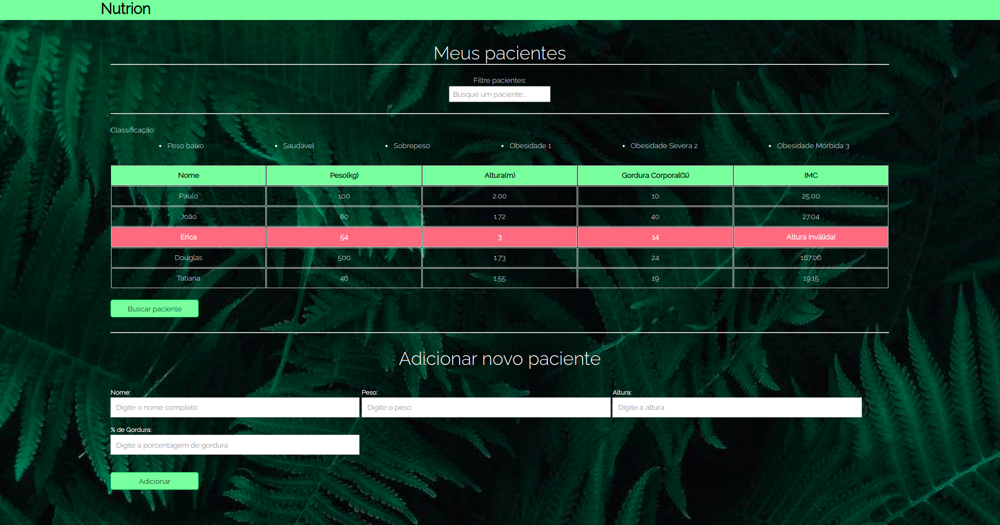

# NUTRION



## O que é?


---

## Funcionalidades
#### Login (Em desenvolvimento)

* É necessário criar uma conta para que possa usufluir de outras funcionalidades e ajustá-las da forma que desejar. No login, é possível se cadastrar e entrar em uma conta já existente.

#### Histórico de Pacientes

* Com esta funcionalidade é possível adicionar, remover ou editar pacientes, leh oferecendo controle sobre os dados.

##### Que dados ele aceita?
* Dados obrigatórios: nome, peso, altura, gordura corporal, hábitos alimentares, em regime. 

#### Diario - DayClient

* O Diario irá ser uma mescla de agenda com bloco de anotações.

---

## Versões 

No momento, o Nutrion está na versão: v1.3.0

#### v1.0
Sua primeira versão não contava com estilos, eventos e sua única funcionalidade era o Painel (que hoje é o Histórico de Pacientes). 


#### v1.2.0
Na sua segunda versão foi incluído uma básica estilização e eventos como: adicionar e deletar pacientes.



#### v1.3.0
Já na terceira versão, pouco a pouco a marca Nutrion foi criada e o layout planejado. Com uma estrutura mais sólida e intuitiva, as duas funcionalidades adicionadas estão sendo implementadas aos poucos e a sua funcionalidade pincipal: o Histórico de Pacientes, está ganhandos novos eventos como: editar dados do paciente.


# codelandia2

# Nutrion


Nutrion é um gerenciamento de pacientes que atualmente conta com três funcionalidades: Login, Histórico de Pacientes e o Diário DayClient. Juntas irão centralizar todas as informações do cliente em um só sistema.

### Ajustes e melhorias

O projeto ainda está em desenvolvimento e as próximas atualizações serão voltadas nas seguintes tarefas:

- [x] Tela de Login
- [x] Diário DayClient
- [x] Dashboard
- [ ] Home
- [ ] Seção de Parcerias

## :computer: Pré-requisitos

Antes de começar, verifique se você atendeu aos seguintes requisitos:
<!---Estes são apenas requisitos de exemplo. Adicionar, duplicar ou remover conforme necessário--->
* Você instalou a versão mais recente de `<linguagem / dependência / requeridos>`
* Você tem uma máquina `<Windows / Linux / Mac>`. Indique qual sistema operacional é compatível / não compatível.
* Você leu `<guia / link / documentação_relacionada_ao_projeto>`.

## :rocket: Instalando <nome_do_projeto>

Para instalar o <nome_do_projeto>, siga estas etapas:

Linux e macOS:
```
<comando_de_instalação>
```

Windows:
```
<comando_de_instalação>
```

## :coffee: Usando <nutrion>

Para usar <nutrion>, siga estas etapas:

```
<exemplo_de_uso>
```

Adicione comandos de execução e exemplos que você acha que os usuários acharão úteis. Fornece uma referência de opções para pontos de bônus!

## :mailbox: Contribuindo para <nutrion>
<!---Se o seu README for longo ou se você tiver algum processo ou etapas específicas que deseja que os contribuidores sigam, considere a criação de um arquivo CONTRIBUTING.md separado--->
Para contribuir com <nutrion>, siga estas etapas:

1. Clone o repositório.
2. Crie um branch: `git checkout -b <nome_branch>`.
3. Faça suas alterações e confirme-as: `git commit -m '<mensagem_commit>'`
4. Envie para o branch original: `git push origin <nome_do_projeto> / <local>`
5. Crie a solicitação de pull.

Como alternativa, consulte a documentação do GitHub em [como criar uma solicitação pull](https://help.github.com/en/github/collaborating-with-issues-and-pull-requests/creating-a-pull-request).

## :handshake: Colaboradores

Agradecemos às seguintes pessoas que contribuíram para este projeto:

<table>
  <tr>
    <td align="center">
      <a href="#">
        <br>
        <sub>
          <b>Rafaella Denlavor</b>
        </sub>
      </a>
    </td>
  </tr>
</table>


## :smile: Seja um dos contribuidores<br>

Quer fazer parte desse projeto? Clique [AQUI](CONTRIBUTING.md) e leia como contribuir.

## :memo: Licença

Esse projeto está sob licença. Veja o arquivo [LICENÇA](LICENSE.md) para mais detalhes.

[:arrow_up: Voltar ao topo](#nutrion)<br>
---
